## R-Ladies Melbourne Inc.: A Chapter of R-Ladies+ Global

[R-Ladies Melbourne Inc.]{style="color:purple"} is a registered non-profit organization and a local chapter of [**R-Ladies+ Global**](https://rladies.org/). Our aim is to promote gender diversity in the R community, both in Australia and worldwide. We welcome members of all R proficiency levels, whether you're a new or aspiring R user or experienced in R programming and interested in mentoring, networking & expert upskilling. Our community is designed to develop our members' R skills & knowledge through social, collaborative learning & sharing. Checkout our [**website**](https://r-ladiesmelbourne.github.io/) to learn more.

## Branding Change: R-Ladies to R-Ladies+

**In my previous report, I wrote the following**: 

As of March 14, 2025, **R-Ladies** Global broadcast that there will be a rebrand to **R-Ladies+** as shown in this [blog post](https://rladies.org/news/rebranding-rladies/) in response to community feedback that the name "R-Ladies" does not fully reflect the diversity of under-represented genders it aims to support.

This change aims to foster broader inclusivity while maintaining the organization’s globally recognized identity. After months of open discussion, the "+" was chosen over a complete name change to avoid confusion, preserve accessibility across languages, and accommodate the limited capacity of the organization’s volunteer-led structure. The re-branding will include a new visual identity and improved social infrastructure, empowering chapters to adopt the changes in ways that align with their local context and safety considerations. This effort reaffirms R-Ladies+’s commitment to fostering an inclusive and welcoming R community for all under-represented gender minorities.

**As of this report**: 

::: {.timeline .vertical .tl-dot-center}
::: {.event data-label="Apr-2025"}
R-Ladies Melbourne officially agreed upon a new name: R-Ladies+ Melbourne, reflecting our mission to advocate for all 
underrepresented genders as well as cis-women. We have updated our logo, website and social media to reflect this change, 
and we have continued included a statement in our housekeeping section of meetup events. 

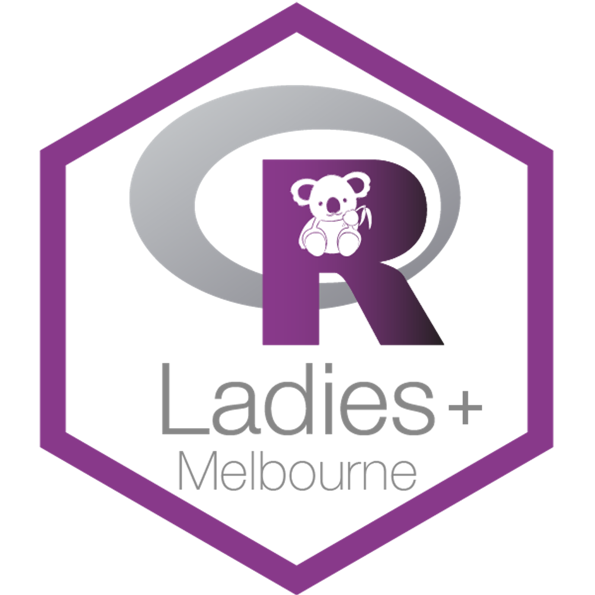{width=100 height=120}
:::
::: {.event data-label="Mar-2026"}
R-Ladies officially rebranded to R-Ladies+ on 29-Mar-2026. This [blog post](https://rladies.org/news/2026/rebrand-launch/) outlines the entire history, rationale and motivation behind the rebrand and redesign of R-Ladies+. The team have generated a new [R-Ladies Organizational Guidance book](https://guide.rladies.org/) for local chapters and volunteers. This is a VERY COMPREHENSIVE book and I hope will be useful for us in understanding these guidelines. This book also contains a brand identity colour palette, typography, logo etc. all included in the quarto extension `glamour` which automatically applies the new `brand.yml`. 

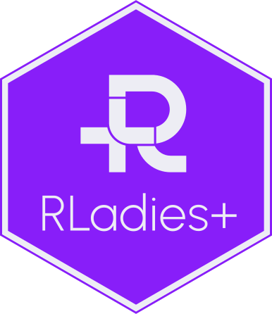{width=120 height=120}
:::
::: {.event data-label="Jun-2026"}
From here onwards, we need to discuss how we incorporate these new changes into our own rebrand. Changing our logo, website colour palette, typography etc. I look forward to seeing how our upcoming committee accomplishes this. 
:::
:::

## Our 2025-26 Committee

Our leadership for 2025-26 R-Ladies+ Melbourne included:

-   **President**: Dionne Argyropoulos
-   **Vice President**: Danyang Dai (Daidai)
-   **Secretary**: Sehrish Kanwal
-   **Treasurer**: Kathleen Zeglinski
-   **Committee members**: Caitlin Bourke, Felicia Bongiovanni, Harriet Mason, Kirsty McCann, Mansi Aggarwal, Mei Du, Maliny Po, Kylie Ainslie
-   **Outgoing members**: Megan Sora, Lauren Smith, Belen Prado, Cecilia Rios Teran

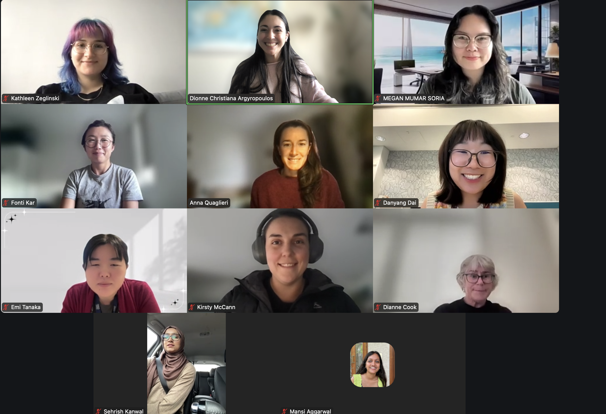

::: column-margin
**Committee**: Kathleen (top left), Dionne (top centre), Megan (top right), Daidai (second row right), Kirsty (third row middle), Sehrish (bottom left), Mansi (bottom right), Belen, Lauren, Caitlin, Felicia, Harriet, Mei, Maliny and Kylie \[not pictured\].

**R-Ladies Sydney**: Fonti (second row left)

**R-Ladies Canberra**: Emi (third row left)

**Advisory Committee**: Anna (second row middle), Di (third row right)
:::

We recruited many committee members at our final events of 2025, welcoming 3 new members by the end of the year.

## Meetup Events

**Meetups Hosted**:

-   [Cross-chapter: TidyTuesday with R-Ladies](https://www.meetup.com/rladies-sydney/events/307276480/?eventOrigin=group_events_list).
-   [Creating simple websites with Quarto + GitHub Pages](https://github.com/R-LadiesMelbourne/28-05-25-Creating-simple-websites-with-Quarto-GitHub-Pages).
-   [Using Git for Version Control and Collaboration](https://github.com/R-LadiesMelbourne/09-07-2025-Using-Git-for-Version-Control-and-Collaboration).
-   [It Takes a Spark 2025: Become a Disease Detective](https://github.com/R-LadiesMelbourne/23-10-25-It-Takes-A-Spark).
-   [R-Ladies Social Night](https://www.meetup.com/rladies-melbourne/events/310287919/?eventOrigin=group_events_list).
-   [Plot Twist: Brining Your ggplot2 Visuals to Life with ggplotly](https://github.com/R-LadiesMelbourne/18-09-25-Plot-Twist-Bringing-Your-ggplot2-Visuals-to-Life-with-ggplotly).
-   [R-Ladies & SSA Melbourne Social Night: Happy 9th Birthday R-Ladies](https://www.meetup.com/rladies-melbourne/events/311337114/?eventOrigin=group_events_list).
-   [R-Ladies at R Dev Days with Dr Heather Turner](https://www.meetup.com/rladies-melbourne/events/311618693/?eventOrigin=group_events_list).
-   [End of Year Networking Event](https://www.meetup.com/rladies-melbourne/events/311618784/?eventOrigin=group_events_list).
-   [Data driven decision making for fantasy basketball](https://github.com/R-LadiesMelbourne/18-03-26-Data-driven-decision-making-in-fantasy-basketball).
-   [Di Cook Award Seminar Watch Party - R-Ladies+ Melbourne & SSA-VIC](https://www.meetup.com/rladies-melbourne/events/313938056/?eventOrigin=group_events_list).
-   [Deep Probabilistic and Generative Modeling](https://www.meetup.com/rladies-melbourne/events/314684648/?eventOrigin=group_past_events).

::: {.column-screen-inset-shaded layout-ncol="2"}
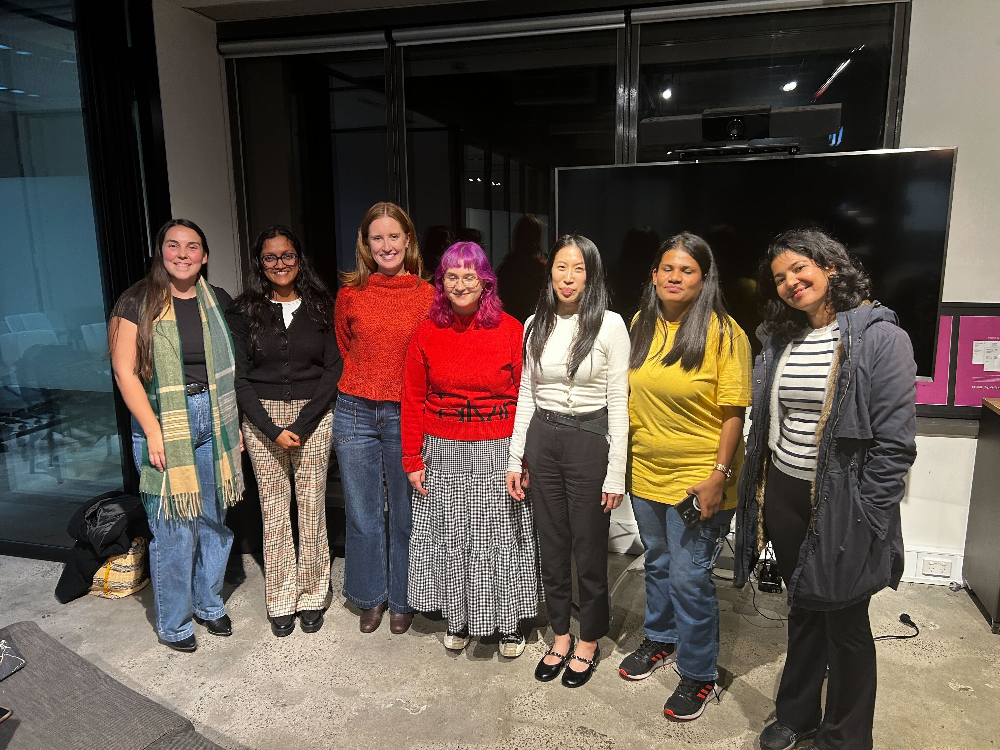

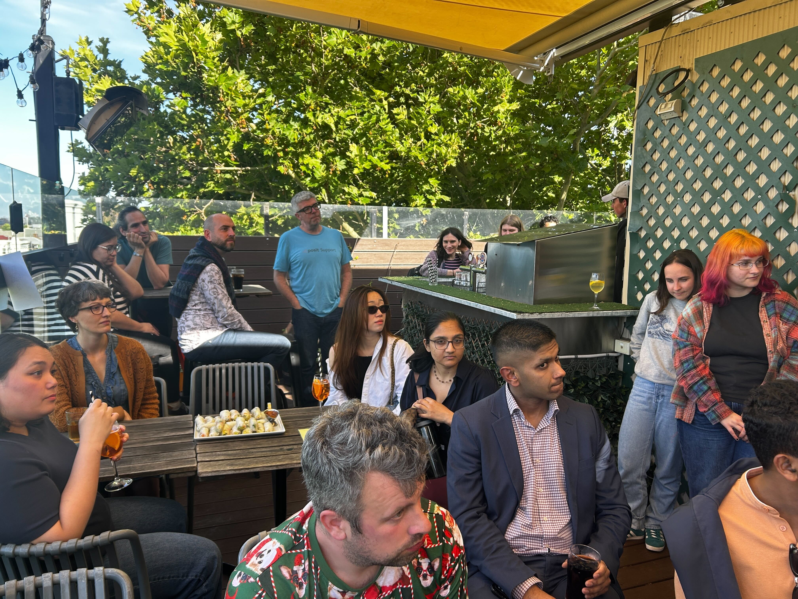
:::

## Event Highlights:

<!-- event 1 -->
::: {.workshop-card}
::: {.card-left}
::: {.card-badge-top}
EVENT
:::
::: {.speaker-imgs}

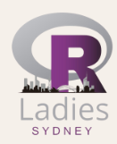
:::
:::

::: {.card-right}
::: {.workshop-speakers-name}
Cross-chapter TidyTuesday with R-Ladies
:::
::: {.workshop-desc}
**Tuesday May 6th, 1:00-2:00PM AEST**
 

We kicked off our 2024–25 committee events with a cross-chapter event on May 6! This event was the product of a new collaboration with our R-Ladies+ Canberra and Sydney friends who we have been in talks with since the end of 2024. This joint-chapter event was the first of hopefully many, many more events that we will host Australia-wide. 

:::
::: {.workshop-links}
[INFO HERE](https://www.meetup.com/rladies-sydney/events/307276480/?eventOrigin=group_events_list){target="_blank"}
:::
:::
:::

<!-- event 2 -->
::: {.workshop-card}
::: {.card-left}
::: {.card-badge-top}
EVENT
:::
::: {.speaker-imgs}

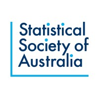
:::
:::

::: {.card-right}
::: {.workshop-speakers-name}
Social Nights and Nineth Birthday!
:::
::: {.workshop-desc}
**Thursday Aug 14th**; **Thursday Oct 16th**
 

We revived our **social nights** to break up the seminars and workshops that were more content-heavy. This allowed us to have some low-key, more networking-focussed events. We held these meetups at Father's Office in the CBD. 

We celebrated our 9th Birthday with SSA-VIC at a social night, and were able to discuss all of our accomplishments over our time as an organisation while meeting new friends!

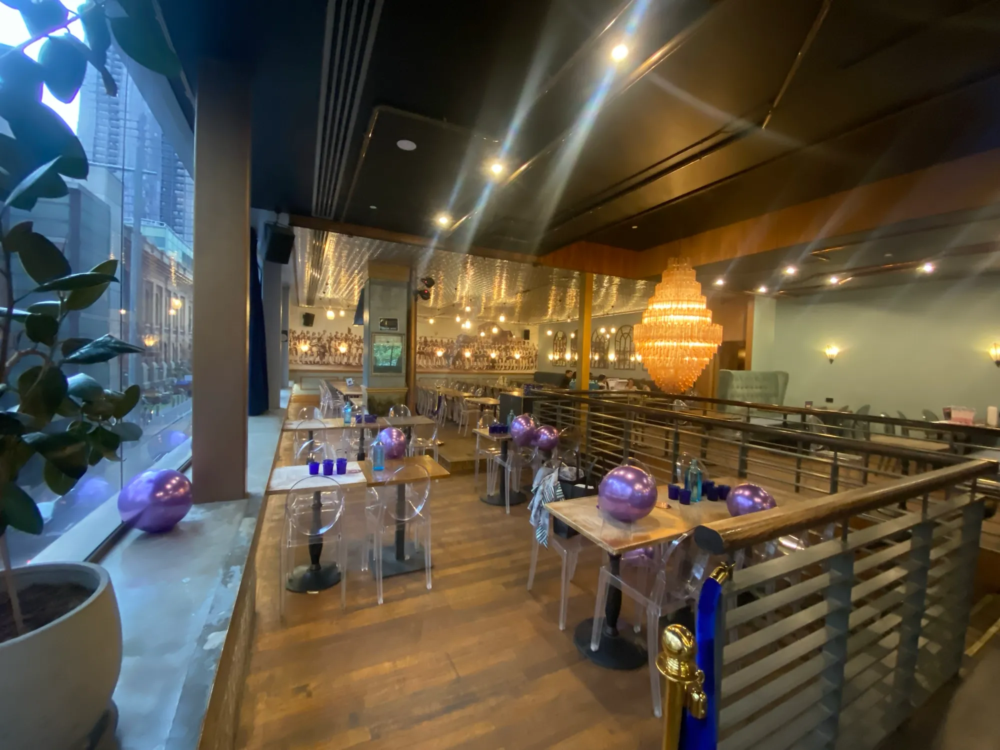
:::
::: {.workshop-links}
[INFO HERE](https://www.meetup.com/rladies-melbourne/events/310287919/?eventOrigin=group_events_list){target="_blank"}
:::
:::
:::

<!-- event 3 -->
::: {.workshop-card}
::: {.card-left}
::: {.card-badge-top}
EVENT
:::
::: {.speaker-imgs}
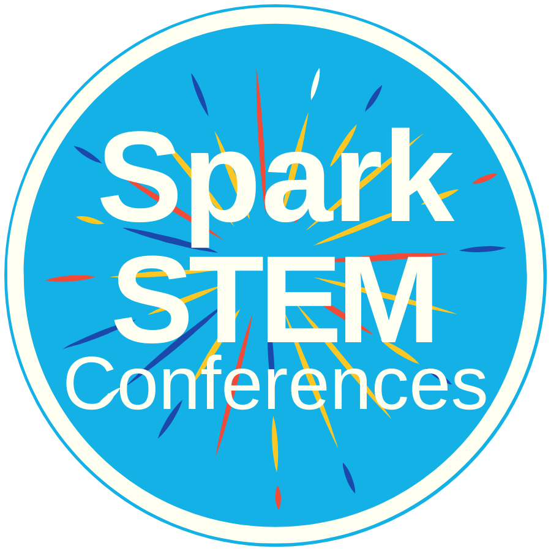
:::
:::

::: {.card-right}
::: {.workshop-speakers-name}
It Takes a Spark 2025: Become a Disease Detective
:::
::: {.workshop-desc}
**Thursday Oct 23rd, 11:00AM-12:20PM AEST**
 

Kirsty and I presented at the annual It Takes A Spark conference at The Knox School (see [here](https://spark-educonferences.com.au/victoria-2024/)), armed with our [bookdown](https://github.com/R-LadiesMelbourne/17-11-23-ItTakesASpark) and [quarto slides](https://github.com/R-LadiesMelbourne/It-Takes-a-Spark-Slides) developed in our 2023 iteration with some updates. We tested the use of A3 print-outs, developed by Felicia, that could help students with code. We also tested the use of pre-written functions, developed by Kathleen, to simplify some of the ggplot2 or dplyr commands that are not necessary for high school students to know and master. This marked the **sixth** year R-Ladies+ Melbourne had participated in the conference!

We also received some feedback from students, not specifically for our session but overall and can pinpoint some things that *may* be referring to our session. 
What students liked the most about the conference: 

- The workshops x11
- I liked learning how to code
- Coding in another language

What changed students' thinking about STEM now that they attended the conference: 

- It is more fun and cooler than I thought
- Science is not just being logical but being creative as well 

Teachers also provided feedback. Including a list of what they'd like to see next year: 

- More on the power of AI and impact of technology will have on the future.
- Workshops need to have a different approach to primary and secondary students. I felt the secondary students were not extended enough.
- Less use of the term "guys" or "you guys" from school-based presenters.

:::
::: {.workshop-links}
[INFO HERE](https://github.com/R-LadiesMelbourne/23-10-25-It-Takes-A-Spark){target="_blank"}
:::
:::
:::

<!-- event 3 -->
::: {.workshop-card}
::: {.card-left}
::: {.card-badge-top}
EVENT
:::
::: {.speaker-imgs}
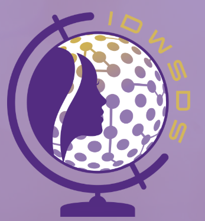
:::
:::

::: {.card-right}
::: {.workshop-speakers-name}
More Than Code: The People, Purpose, and Power of R-Ladies+
:::
::: {.workshop-desc}
**Tuesday Oct 14th, 1:30-2:30PM UTC**
 

We had the priviledge of joining with our R-Ladies+ Sydney colleagues to participate in a panel discussion for the International Day of Women in Statistics and Data Science (IDWSDS). In this panel, Felicia, Giorgia, Kristy and I discussed our journeys to R-Ladies+, what we aim to do as part of this organisation, and all of the possibilities that have developed following our involvement. 

:::
::: {.workshop-links}
[YOUTUBE VIDEO HERE](https://www.youtube.com/watch?v=dWUSP2Jj270&list=PLMWQJOo52Q5WU7sSJbaxtspKlxZtgzA8Q&index=8){target="_blank"}
:::
:::
:::

<!-- event 5 -->
::: {.workshop-card}
::: {.card-left}
::: {.card-badge-top}
EVENT
:::
::: {.speaker-imgs}
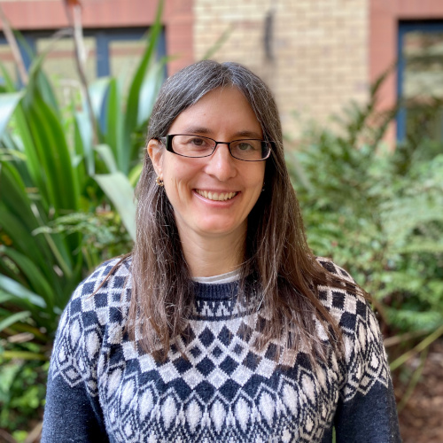
:::
:::

::: {.card-right}
::: {.workshop-speakers-name}
R-Ladies at R Dev Days with Dr Heather Turner
:::
::: {.workshop-desc}
**Wednesday Nov 12th, 5:30-7:30PM AEST**
 

I had never heard of R Dev Days before, let alone even think that we could even be able to contribute to the development of this program that we all use. Meeting and hearing from Heather to talk about her experience in the inception of these development days, her commitment to open source software and R-Ladies globally was a real treat. We were so happy to host her at Monash City Campus and then participate in the R Dev Day itself the following week! 

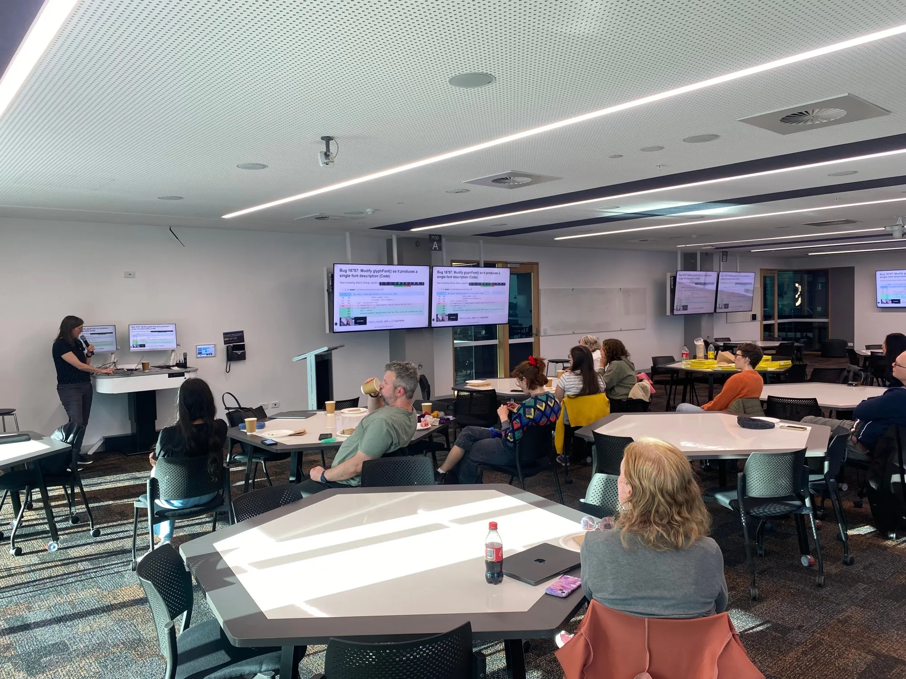

:::
::: {.workshop-links}
[INFO HERE](https://www.meetup.com/rladies-melbourne/events/311618693/?eventOrigin=group_events_list){target="_blank"}
:::
:::
:::

<!-- event 6 -->
::: {.workshop-card}
::: {.card-left}
::: {.card-badge-top}
EVENT
:::
::: {.speaker-imgs}

:::
:::

::: {.card-right}
::: {.workshop-speakers-name}
End of Year Networking Event
:::
::: {.workshop-desc}
**Thursday Dec 11th, 5:30-7:30PM AEST**
 

Building upon the success of our 2024 event, we planned another end-of-year networking event at The Clyde in Carlton to celebrate 2025. We were joined by five incredible mentors: Hannah Comiskey, Alyssa Hu, Mun Hua Tan, Anna Quaglieri and Belinda Phipson - who generously shared their career journeys, insights, and advice that brought them to their current roles in areas ranging from public health, genomics, bioinformatics, programming and software engineering!

It was a wonderful evening of connection, learning, and celebration, and a perfect way to wrap up another great year for R-Ladies+ Melbourne!

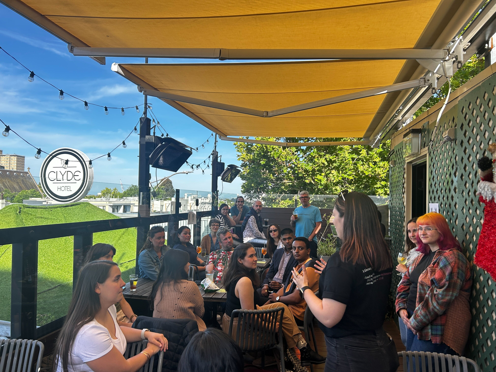

:::
::: {.workshop-links}
[INFO HERE](https://r-ladiesmelbourne.github.io/outputs/eoy2025.html){target="_blank"}
:::
:::
:::

<!-- event 5 -->
::: {.workshop-card}
::: {.card-left}
::: {.card-badge-top}
EVENT
:::
::: {.speaker-imgs}
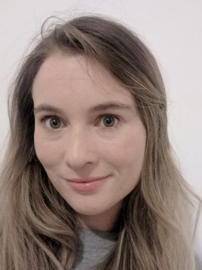
:::
:::

::: {.card-right}
::: {.workshop-speakers-name}
Data driven decision making for fantasy basketball
:::
::: {.workshop-desc}
**Wednesday Mar 18th, 5:30-7:30PM AEDT**
 

We kicked off our 2026 Meetups with Dr Kate Saunders. This talk was wholly inspired from Kate's recreational commitment to fantasy basketball. She applied tools from her own statistical background into forecasting and advanced visualisations to inform her decisions for fantasy basketball. 

I keep thinking back to this talk - It has inspired me to look into how I can be creative with all of the knowledge I've amassed for work or educational purposes. This talk reminds me that coding is so much more than a means to an end - it's about having fun! 

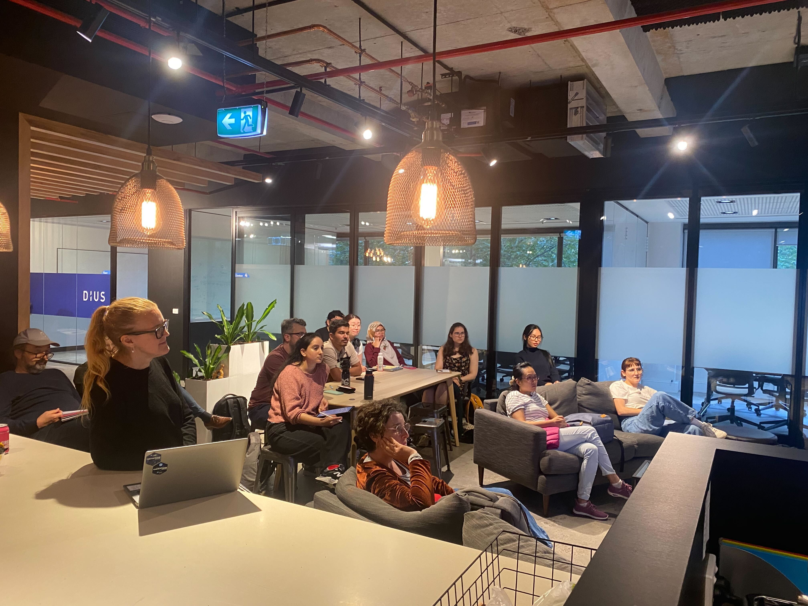
:::
::: {.workshop-links}
[INFO HERE](https://www.meetup.com/rladies-melbourne/events/313639240/?eventOrigin=group_events_list){target="_blank"}
:::
:::
:::

## Launch of our in-house book!

It's no secret that I have been thrown myself into almost every part of R-Ladies+ Melbourne. As part of my recent attempts to not take everything on wholly by myself, I wanted to share a manifesto book that contains all the existing information about our infrastructure, goals, mission, event planning, and combine it with information that I have learned over the years that I have found to work. 

My goal is that this in-house book will grow into a commonly used resource that can be updated with new information. I also hope that we move away from word-documents and publish these notes in this book, with version control. I have labelled the version `v.1.0.0`. For more please see the github repository [here](https://github.com/R-LadiesMelbourne/R_Ladies_Melb_Guide).

## A Personal Note from Me

Thank you. 

2025 was the first year we hosted an event every month since pre-COVID times! And we're on track to continue this trend this year! I am so incredibly proud of all the work we have put into creating fun, inclusive, thought-provoking events, and slowly chipping away at buliding an infrastructure for this non-profit organisation that will outlast us. I am so excited to see all of the work we have to come. Thank you to our organising committee for allowing me to chair our meetings and take the reins over the past two years. I have learned so much about being in leadership positions and while I'm still a work in progress, I know that I wouldn't have been able to learn these skills without the safety and comraderie of this amazing team. I am so excited for the next 2026-27 committee year - for all the inspiring, diverse, educational talks and continuing to empower both cis-women and under-represented genders in the R community as part of R-Ladies+. 

💜

## Sponsors

A great thanks to all of our supportive sponsors especially posit, Monash City Campus and DiUS.

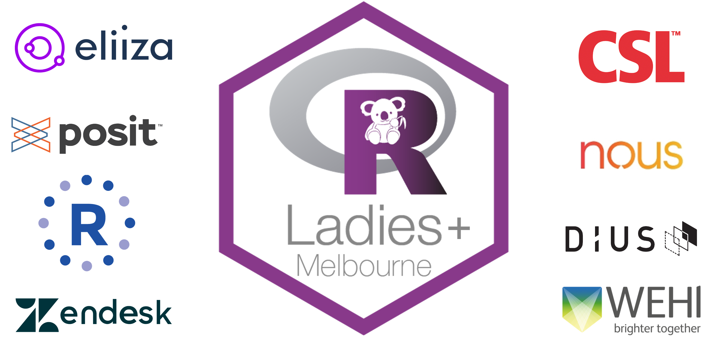

## Acknowledgements

I would like to thank all of the past and present committee members for their support and friendship.
